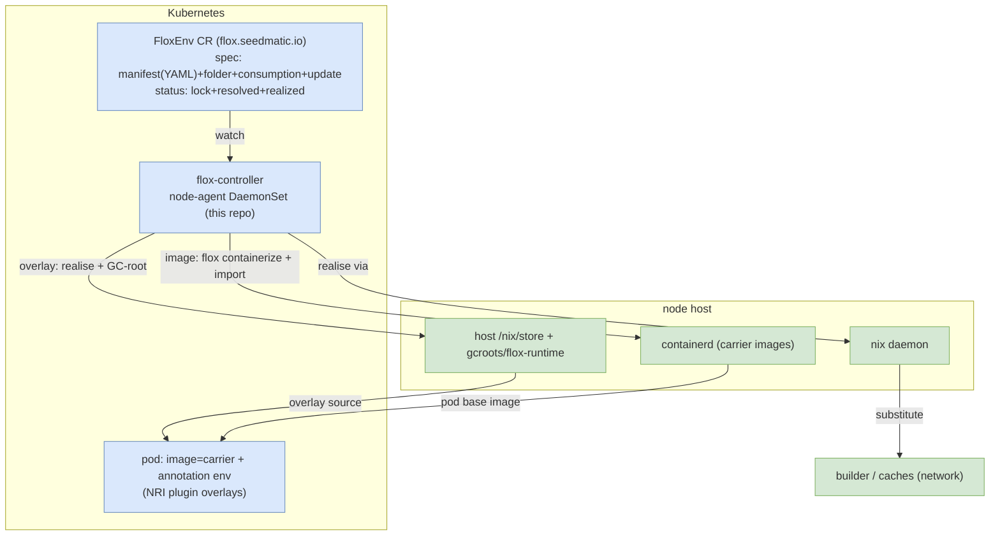

# flox-controller — design

`flox-controller` delivers **flox environments to Kubernetes nodes at runtime**, as
first-class k8s resources. It is **pure-k8s and reusable** — it knows only
`(namespace, name)`, never any consumer's conventions (rke2lab's "domain", its
`environment.d`, its image baking — all of that lives in the *consumer* and is out of
scope here).

Two pieces ship from this repo:

- the **`FloxEnv` CRD** (group `flox.seedmatic.io`, `v1alpha1`) — a flox env as a k8s
  resource;
- the **controller** — a **node-agent** (one instance per node, run as a DaemonSet)
  that reconciles each node's local nix store to the desired `FloxEnv`s.

Its companion, the NRI plugin (repo `flox-nri-plugin`), injects an env into a pod at
container-create; this controller *provisions* what the plugin injects. See
[the seam](#the-seam-with-the-nri-plugin).

> **Not air-gapped (for now).** Nodes have network; the controller substitutes /
> containerizes freely from the builder + caches. We do **not** build offline logic.
> Air-gap may return as a future constraint — the design must not *preclude* it, but we
> don't build *for* it now. Distinct from that: we **do not use FloxHub** — an env's
> lock is resolved from its manifest and held in `status` (determinism + ownership).

## The `FloxEnv` resource

Designed **maintenance-first**: `spec` is the maintainer-authored INTENT (the flox
manifest as YAML, the host folder, the update policy); `status` is GENERATED and never
hand-edited (the lock, what resolved, per-node realisation). Maintaining an env is a
loop: **introspect `status`, adjust `spec`**.

```yaml
apiVersion: flox.seedmatic.io/v1alpha1
kind: FloxEnv
metadata: { name: kdns, namespace: networking }
spec:
  consumption: overlay              # overlay | image   (default: overlay)
  manifest:                         # the flox manifest AS YAML — a transposition of
    install:                        #   manifest.toml (SAME shape, not re-modelled)
      kdns:    { flake: "github:seedmatic/...#kdns" }
      kubectl: { pkg-path: kubectl }
    include:                        # flox-native, by PATH → other envs' host folders
      environments:
        - dir: ../../flox-system/base
    vars: { FLOX_FOO: bar }
    # hook / profile / options / services — whatever flox supports
  update: { mode: Manual }          # lock-refresh policy (Manual | Track)
  folder: networking                # host-layout path; default = metadata.namespace
status:
  lock: "..."                       # GENERATED — the resolved manifest.lock (the pin)
  resolved: { kdns: 0.2.15 }        # GENERATED — what each package resolved to
  realized:
    - { node: node-a, ready: true, storePath: /nix/store/...-env }
```

- **`spec` = intent.** `manifest` — the **flox manifest as YAML**, a faithful
  transposition of `manifest.toml` (same shape, NOT re-modelled: `install`, `include`,
  `vars`, `hook`, …); the controller serialises it back to `manifest.toml`. Composition
  stays **flox-native**: `include` uses PATHS (`../../<folder>/<name>`) that resolve to
  other envs' host folders — the CR does not model includes (no CR↔manifest conflict).
  `update` (lock-refresh policy); `folder` (the HOST-materialisation path — dissociated
  from the k8s namespace, MAY be structured like `mesh/base`, defaults to
  `metadata.namespace`; it is what other envs' `include` paths resolve against).
- **`status` = generated, never hand-edited.** `lock` (the resolved `manifest.lock`, the
  deterministic pin), `resolved` (what each package resolved to — inspection), `realized`
  (per-node; the plugin/consumers read the resolved `storePath`).
- **The lock lives in `status`** so the maintenance loop is *introspect (`status`) →
  adjust (`spec`)* — you never hand-edit a lock; you edit the manifest and the lock
  refreshes. The node-agent **never locks** (no per-node drift); it realises
  `status.lock` verbatim.

> **Open axis — who produces `status.lock`.** Locking resolves the manifest against a
> catalog. Options: the operator **env-bumper** (catalog access stays at the operator,
> no in-cluster FloxHub) vs an in-cluster **lock-controller** reacting to `spec` changes
> per `spec.update` (more automatic, but needs in-cluster catalog access → FloxHub or a
> self-hosted catalog). We avoid FloxHub → leans operator-bumper or a local catalog. To settle.

### Consumption modes

A `FloxEnv` is consumed one of two ways — the CR's `spec.consumption` marks which, and
the controller branches on it:

| `consumption` | The controller… | Used as |
|---|---|---|
| `overlay` (default) | realises the closures onto the host `/nix/store` + writes the `flox-runtime` GC-roots | a workload env the NRI plugin overlays into a pod at container-create |
| `image` | realises the closures + **`flox containerize`s** the env + imports the image into the node's containerd | a **carrier** — the OCI base image a pod's rootfs runs on |

The `FloxEnv` definition + `[include]` composition are the **shared abstraction**;
only the consumer differs.

## The controller (node-agent)

One instance per node (DaemonSet). Each instance reconciles **its own node** (from the
Downward API `NODE_NAME`) and patches that node's `status.realized` entry. It is the
**sole writer** of the node's `gcroots/flox-runtime/` subtree and of the flox env
layout under `<envroot>/`.

Reconcile-to-desired, one pass:

```
desired = FloxEnv CRs (watched)
for env in desired:
  serialise spec.manifest (YAML → manifest.toml) at <envroot>/<folder>/<name>/
    (its flox [include] paths resolve to sibling envs, materialised likewise)
  ask the node nix daemon to realise status.lock's closures onto the host /nix/store
  if consumption == overlay:  write the GC-root(s)
  if consumption == image:    flox containerize + import into containerd
  patch status.realized[node]
prune layout entries + GC-roots no longer desired      # same pass, sole writer
```

Disk reclaim of pruned closures is a separate `nix.gc` cadence (not the controller's job).

## Carriers (`FloxEnv`, `consumption: image`)

A **carrier** is the OCI base image a flox pod runs on — deliberately minimal: it only
needs what `flox activate` requires to bootstrap. The workload's binaries do **not**
live in it; they ride the `/nix` overlay the NRI plugin mounts.

- **Containerized ON the node** by the controller (`flox containerize` from the
  materialised env → import into containerd), **not** baked at image-build. Because
  every `FloxEnv` is materialised on the node, **specialising a carrier is cheap**: a
  new `image` `FloxEnv` that `[include]`s the base carrier + its extras, re-containerized
  locally (the base's closures are already present → mostly cache-hit).
- **Chicken-and-egg is resolved**: the *controller's own* image is provided by the
  consumer as a foundation artifact (this repo's `flox-controller-image`); the
  controller needs no carrier to start, and it produces the carriers for workload pods.
  Ordering to the first workload pod is handled by the plugin being fail-closed +
  Kubernetes retry.

### The carrier-contract invariant

Every `image` `FloxEnv` used as a carrier **must satisfy the carrier contract** — the
minimum `flox activate` needs to bootstrap:

- `/usr/bin/env`, a shell + coreutils,
- real `/etc/{passwd,group,nsswitch.conf}` (flox activate does `getpwuid(0)` at start —
  no `/etc/passwd` ⇒ it dies `ENOENT`),
- a CA bundle.

It satisfies the contract **either** by `[include]`-ing the **default/base carrier**
(which provides it — the easy, cheap path since the base is materialised) **or** by
providing the equivalent itself. The base carrier `FloxEnv` is the **canonical contract
provider and the root of the carrier composition tree**.

Enforcement (design pending): a validating admission check — reject/flag a carrier that
neither includes the base nor carries a `self-provides-contract` marker.

## The seam with the NRI plugin

The plugin (repo `flox-nri-plugin`) is a **separate component**; the boundary:

- **Controller** — provisions: closures + GC-roots on the node (overlay envs), carrier
  images in containerd (image envs). Owns `status`.
- **Plugin** — at container-create, resolves a pod's `flox.seedmatic.io/environment.<c>`
  annotation to a `FloxEnv` CR, overlays the host `/nix` into the container, and runs
  `flox activate`. It is **carrier-agnostic** — it works with whatever contract-
  satisfying carrier the pod chose (the carrier is set on the pod's `image:` at
  admission by the author or a mutating webhook, never by the plugin).

The `FloxEnv` CR is the shared contract both read.

## C4 — context



## Open / to verify

- **`flox containerize` without FloxHub** — confirm it builds the carrier image from a
  LOCAL env + the node store, no FloxHub round-trip (the same independence we need
  everywhere). Not an air-gap question (network is available) — a FloxHub-dependency one.
- **Carrier-contract enforcement** — the admission check shape (`[include]` base vs a
  `self-provides-contract` marker).
- **Reconcile status ordering** — the plugin is fail-closed; confirm containerd's NRI
  knob propagates a create error to a k8s retry.

## Related

- `flox-nri-plugin` — the injection companion (overlay + `flox activate`).
- The consumer's integration view (e.g. rke2lab): how `FloxEnv` CRs are synthesised, how
  the controller + plugin images are delivered, and the node-substrate atlas.
